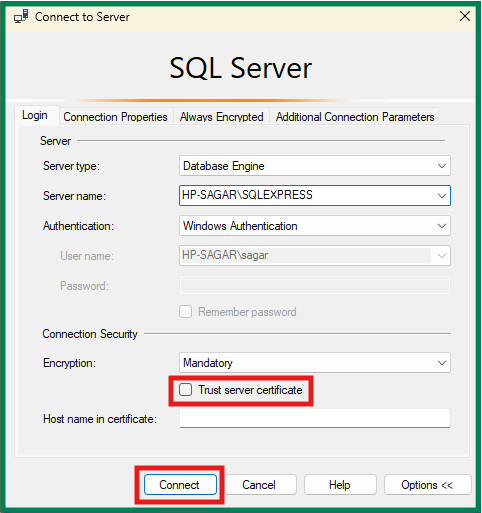
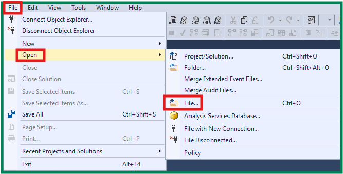

1. EMRSimulationWebApp - folder contains all the source code files of the EMR Simulator web application.
2. PublishedWebsite - folder contains all the deployment files of the web application
3. DatabaseSchema.sql - file contains the database schema, tables, and stored procedures for managing patient records, IV fluid administration, medication charts, lab details, and user authentication in an EMR simulation system.

---

# HOW TO RUN THE EMR SIMULATOR WEB APPLICATION

To run the EMR Simulator website, follow these steps:

## Prerequisites

1. **SQL Server** - Ensure SQL Server Express is installed and running
2. **.NET SDK** - Have .NET SDK installed on your machine

## Setup Steps

1. **Create the Database** (first time only)
   - Open SQL Server Management Studio (SSMS)
   - Execute the SQL schema file: Databaseschema_three.sql
   - Or run: EmrSimulator_full_After_update_2026-01-13.sql for the complete setup

2. **Restore NuGet Packages** (in the root directory)

   ```powershell
   dotnet restore
   ```

3. **Run the Application**

   ```powershell
   cd EMRSimulationWebApp/EMRSimulationWebApp
   dotnet run
   ```

4. **Access the Website**
   - Open your browser and navigate to: `https://localhost:5001` or `http://localhost:5000`
   - Login with your credentials (default user should be set up from the database schema)

## Configuration

- The application uses **SQL Server Express** with connection string configured in appsettings.json:
  ```
  Server=.\SQLEXPRESS
  Database=EmrSimulator
  User ID=sa
  Password=Emrp@ssword123!
  ```

---

## Database Setup Guide for Beginners

Here's what you need to do step-by-step:

### Step 1: Install SQL Server Express (if not already installed)

1. Download [SQL Server Express](https://www.microsoft.com/en-us/sql-server/sql-server-editions-express) from Microsoft
2. Run the installer and select **"Basic"** installation
3. Accept the defaults and complete installation
4. Also install **SQL Server Management Studio (SSMS)** - this is the tool you'll use to manage databases

### Step 2: Create the Database

1. Open **SQL Server Management Studio** (search for "SSMS" on Windows)



- Enable Trusted server certificate.
- Connect

2. Connect using:
   - Server name: `.` or `localhost` or `.\SQLEXPRESS`
   - Authentication: Windows Authentication (default)

3. Right-click on **Databases** → Select **New Database**
4. Name it: `EmrSimulator` (must match the connection string)

### Step 3: Load the Database Schema



1. In SSMS, click **File** → **Open** → **File**
2. Navigate to the project root and open EmrSimulator_full_After_update_2026-01-13.sql
3. Click the **Execute** button (or press Ctrl+E)
4. This will create all the necessary tables and data

### Step 4: Verify Connection

The connection string in appsettings.json is:

```
Server=.\SQLEXPRESS
Database=EmrSimulator
User ID=sa
Password=Emrp@ssword123!
```

If you installed with a different password or setup, update these values accordingly.

### Step 5: Run the Application

Once the database is ready, run:

```powershell
dotnet run
```

### Extra Guidance

Credentials Summary
Based on the database schema I found, here are the login credentials for the EMR system:

Supervisor Credentials
bersuper / Mb39R (Berwick Lab)
mthsuper / 7zGd3 (Mt Helen Lab)
gipsuper / Ah48i (Gippsland Lab)
bersuper1 / 9RMb3 (Berwick Supervisor 1)
bersuper2 / b39RM (Berwick Supervisor 2)
bersuper3 / 39RMb (Berwick Supervisor 3)
mthsuper1 / d37zG (Mt Helen Supervisor 1)
mthsuper2 / zGd37 (Mt Helen Supervisor 2)
mthsuper3 / Gd37z (Mt Helen Supervisor 3)
gipsuper1 / 8iAh4 (Gippsland Supervisor 1)
gipsuper2 / h48iA (Gippsland Supervisor 2)
gipsuper3 / 48iAh (Gippsland Supervisor 3)

How to Create New Accounts
Based on the code architecture, new accounts are typically created by inserting records into the Supervisor or Student tables in the database:

For Supervisors:

INSERT INTO [dbo].[Supervisor] ([UserName], [UserLogin], [UserPassword], [LabId])
VALUES ('New Supervisor', 'newsuper', 'password123', 1)
